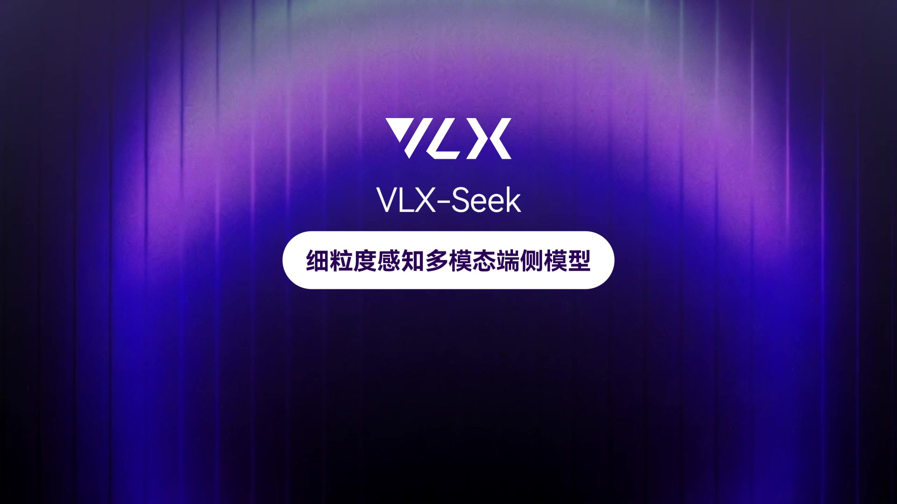

<p align="center">
  
</p>

<h1 align="center">VLX-Seek</h1>

<h3 align="center">VLM 细粒度感知增强：从“坐标生成”到“区域指代”</h3>

<p align="center">
  <a href="README.md">English</a> | 中文
</p>

<p align="center">
  <a href="https://x.com/OmAI_lab">
    
  </a>
  <a href="">
    
  </a>
  <a href="https://platform.om-agent.cn/subapp-index/#/front">
    
  </a>
  <a href="">
    
  </a>
</p>


<p align="center"><sub>介绍视频：VLX-Seek 面向细粒度感知的多模态端侧模型</sub></p>

<p align="center">
  <a href="https://github.com/om-ai-lab/VLX-Seek/releases/download/v0.0.1/vll_seek_zh.mp4?raw=true" target="_blank">
    
  </a>
</p>


<p align="center">
  
</p>

VLX-Seek 是一个面向端侧具身视觉的细粒度感知视觉语言模型。它关注的不是让模型只回答“画面里有什么”，而是让模型进一步知道目标在哪里、是哪一个实例、是否符合用户描述，以及目标不存在时是否应该拒识。

不同于让语言模型直接生成边界框坐标，VLX-Seek 将定位任务改写为区域检索与区域引用问题。候选区域会被编码成可寻址的区域 token，语言模型通过选择、比较和引用这些区域来完成 grounded 输出。

## 项目概览

现代 VLM 在全局场景理解上已经很强，可以描述图像、回答视觉问题、理解复杂指令，并进行多模态推理。但细粒度感知需要另一类能力：

- **精确定位：** 判断目标在哪里，以及边界应如何与相邻物体区分。
- **实例区分：** 找到自然语言描述真正指向的目标实例。
- **多目标推理：** 判断有多少个目标，以及应该返回哪些区域。
- **开放词汇拒识：** 当图像中没有匹配目标时，应该回答不存在，而不是幻觉式生成框。

许多 VLM 会通过生成 `[x1, y1, x2, y2]` 这样的坐标来处理定位。但这种形式对语言模型并不稳定。坐标是较长的数字序列，多目标会进一步拉长输出，一处格式、顺序或范围错误都可能导致结果无法解析或位置明显偏离。

VLX-Seek 将任务从：

```text
图像 + 文本查询 -> 生成坐标数字 -> 解析边界框
```

转变为：

```text
图像 + 区域 token + 文本查询 -> 检索匹配区域 -> grounded answer
```

这种形式更接近 LLM 擅长的能力：比较、选择、指代、解释和推理。

## 开源模型

模型权重即将开源。

## 问题设定

具身和端侧视觉系统需要稳定的空间锚点。机器人、无人机、摄像头、移动设备和巡检系统往往不仅需要知道“画面里有什么”，还需要知道：

- 目标在哪里
- 指令指的是哪一个实例
- 目标是否仍然存在
- 目标和周围物体是什么关系
- 检测的对象是否不存在

VLX-Seek 关注的核心问题是：

> 如何让 VLM 获得细粒度定位能力、提升推理效率，并避免让语言模型生成脆弱的坐标字符串？

VLX-Seek 的答案是：
> 把视觉区域变成语言模型可以寻址和引用的实体。

## 区域引用

VLX-Seek 将候选视觉区域建模为可寻址的区域 token。为了便于理解，可以把它们看作 `<region0>`、`<region1>` 和 `<region2>` 这样的区域索引；在模型实际使用的 special token 形式中，这些区域会以 `<obj0>`、`<obj1>` 和 `<obj2>` 表示。两种写法指向的是同一件事：每个 token 都对应图像中的一个候选视觉区域。

当用户问“找到穿红衣服的人”时，模型不需要从零开始写出四个坐标数字。它可以阅读候选区域 token，判断哪个区域最符合描述，然后输出对应的 `<obj*>` 区域引用。

例如：

```text
<ground>穿红衣服的人</ground><object><obj2><obj5></object>.
```

其中 `<obj2><obj5>` 是模型对第 2 个和第 5 个候选区域的实际 special token 输出形式。模型输出后，系统可以通过这些区域索引快速回查输入时对应的候选区域，并映射到实际 bbox 坐标。这种输出更短、更容易解析，也比长坐标序列更符合语言模型的工作方式。同一套机制可以支持开放目标检测、指代表达理解、区域描述、区域问答、OCR、计数和视觉推理。

## 推理流程

VLX-Seek 使用解耦的区域优先推理流程。

### 1. 候选区域生成

系统首先通过候选区域生成网络召回可能包含前景目标的候选区域。这一步负责提出可能的对象区域，而不是做最终语义判断。

候选区域生成模块与 VLM 主体解耦。实际部署中，它可以灵活地替换为其他检测器，也可以直接使用用户给定的框或视觉提示区域。

### 2. 混合细粒度区域编码器

候选框本身只是几何提示，并不能告诉语言模型区域里是什么。VLX-Seek 因此使用混合细粒度区域编码器 HFRE，将每个候选区域转换成区域级视觉表示。

HFRE 结合两条互补视觉路径：

- **语义路径：** 保留基础 VLM 的视觉语言对齐能力和高层图像理解能力。
- **细节路径：** 提供更高分辨率的局部细节、空间结构、边界、纹理和小目标信息。

SimpleFP 为 ViT 类视觉特征补足多尺度表达，使模型能够同时处理大目标和小目标。随后，区域特征会通过区域-语言连接器投影到 LLM 的嵌入空间中，让每个候选框真正变成语言模型可以读取和引用的区域 token。

### 3. 基于 Token 的推理

区域编码完成后，模型输入中同时包含全局图像 token、文本 token 和带编号的区域 token。LLM 可以基于语言查询在候选区域中进行检索，并通过区域 ID 输出 grounded 结果。

整体路径可以概括为：

1. 召回候选区域。
2. 将每个区域编码成 token。
3. 将语言查询与区域 token 匹配。
4. 输出区域引用和自然语言推理。

## 支持的能力

VLX-Seek 支持多种细粒度感知任务：

- **开放词汇检测：** 根据灵活文本标签查找目标。
- **指代表达理解：** 找到复杂描述对应的目标实例。
- **区域 OCR：** 读取指定视觉区域中的文字。
- **区域 VQA：** 回答关于指定区域的问题。
- **区域描述：** 对选中区域进行细粒度描述。
- **目标计数：** 先检测目标实例，再聚合计数。
- **视觉区域推理：** 使用显式区域作为多步回答的视觉证据。

## 训练策略

VLX-Seek 使用两阶段训练策略，在增强细粒度感知能力的同时，尽量保留基础 VLM 的通用能力。

### 1. 区域-语言对齐

第一阶段让模型学习区域 token 与视觉区域之间的对应关系。训练时主要冻结 VLM 主干，将学习压力集中在 HFRE、区域-语言连接器和新增特殊 token 上。

这个阶段的目标是建立基础能力：让语言模型能够把一个区域 token 当作视觉实体来读取。

### 2. 感知指令微调

第二阶段引入更丰富的感知指令，包括检测、指代表达理解、区域描述、区域推理、计数和 OCR。

这一阶段重点处理两个风险：

- **灾难性遗忘：** 混入通用 VLM 指令数据，保留图像理解、VQA、描述和推理能力。
- **幻觉式定位：** 加入负样本和拒识样本，让模型在目标不存在时回答没有匹配目标，而不是强行输出区域。

VLX-Seek 不只学习“如何找到目标”，也学习“什么时候不该找”。

## 结果对比

VLX-Seek 的 3B 版本模型在多个细粒度感知任务上展现出较强的性能，超过了许多参数规模更大的开源和闭源大模型。

<table align="center">
  <tr>
    <td width="50%" align="center">
      
    </td>
    <td width="50%" align="center">
      
    </td>
  </tr>
  <tr>
    <td width="50%" align="center">
      
    </td>
    <td width="50%" align="center">
      
    </td>
  </tr>
</table>

## 为什么是 VLX-Seek

- 相比通用 VLM，VLX-Seek 显式建模候选视觉区域，可以把回答锚定到具体对象实例。

- 相比传统检测器，VLX-Seek 能利用自然语言、开放词汇语义和视觉推理，而不只是预测封闭类别。

- 相比坐标生成式 VLM，VLX-Seek 避免输出较长的数字坐标序列，改用更短、更稳定的区域引用。

- 相比简单外接检测头的方案，VLX-Seek 把区域变成模型内部可以读取和引用的视觉语言实体，使区域能够参与推理、比较、对话和解释。

## 技术脉络

我们团队长期深耕视觉感知领域，此前推出的 [OmDet-Turbo](https://github.com/om-ai-lab/OmDet)、[VLM-R1](https://github.com/om-ai-lab/VLM-R1) 与 [VLM-FO1](https://github.com/om-ai-lab/VLM-FO1) 等开源项目在社区获得了广泛关注和认可。VLX-Seek 汇聚并延续了这些工作在开放词汇检测、区域级理解与细粒度感知上的技术积累，是 VLX 系列的最新作品之一，后续也将持续更新迭代。

## 关注我们

您可以通过 [X](https://x.com/OmAI_lab) 关注 Om AI Lab，或扫描下方微信社群二维码关注 VLX 的更新与讨论。

<p align="left">
  
</p>
